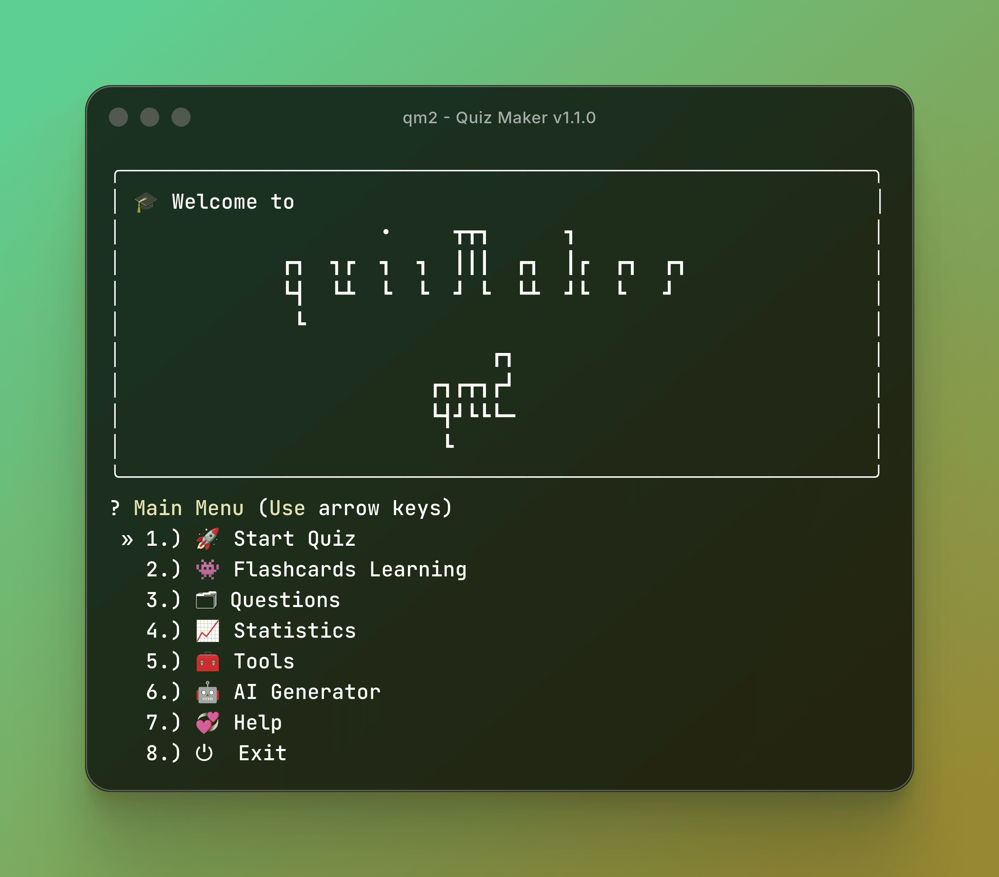
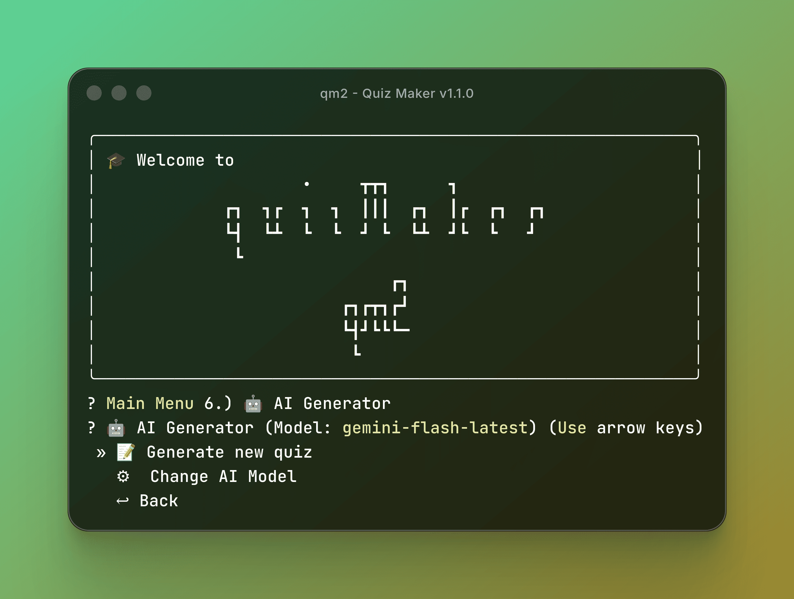
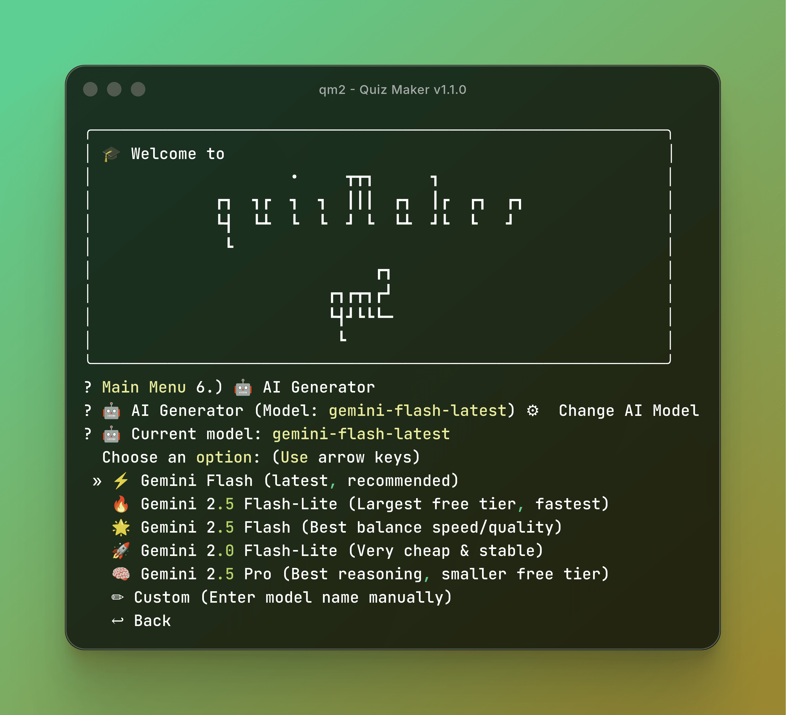
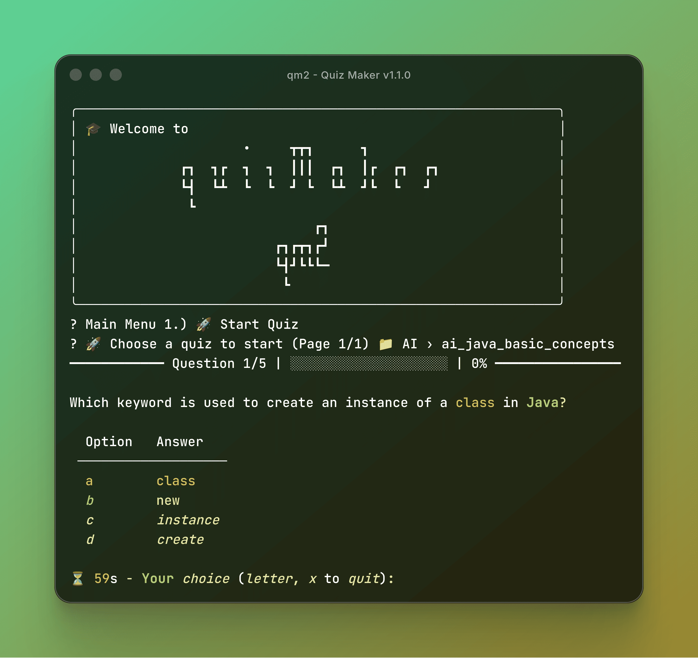
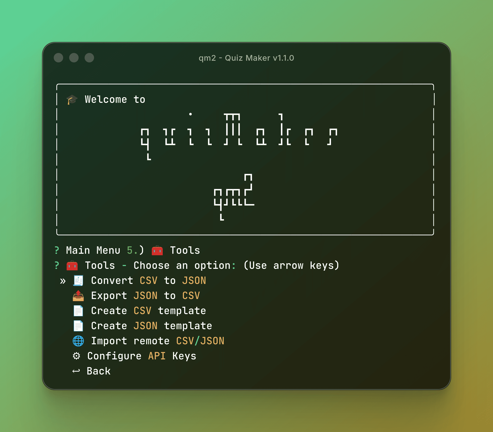

<div class="flex flex-wrap gap-2 mb-6 justify-start">
  <a href="https://badge.fury.io/py/qm2"></a>
  <a href="https://pypi.org/project/qm2/"></a>
  <a href="https://opensource.org/licenses/MIT"></a>
  <a href="https://github.com/ahalvadzija/qm2"></a>
  <a href="https://github.com/ahalvadzija/qm2/actions/workflows/pipeline.yml"></a>
</div>



### QM2 Evolution: From Static Engine to AI-Powered Intelligence

A few weeks ago, I introduced QM2 v1.0.25 — a high-performance CLI quiz engine built for speed and reliability. It was a solid foundation with 330+ tests, but it had one major "friction" point: content creation. Writing 50 questions about Kubernetes or React manually is tedious.

After taking a short detour to build my event-driven portfolio with Hugo and Supabase, I returned to QM2 to solve the content problem. Today, I’m excited to announce QM2 v1.1.0. I’ve officially added a "brain" to the engine by integrating Google Gemini AI.

### The Vision: Zero-Friction Learning



The mission was simple: Go from a blank screen to a 20-question, high-quality quiz in under 10 seconds. By leveraging the Gemini 1.5 & 2.0 Flash models, QM2 can now generate comprehensive study materials on any topic instantly, directly from your terminal.

### New Tech in the Stack



To support AI generation without compromising the "brutalist" speed of the CLI, I added:

- **Google GenAI SDK**: For seamless communication with Gemini models.
- **Exponential Backoff Logic**: Ensuring the app handles API rate limits gracefully.
- **Advanced JSON Sanitization**: A custom module that strips AI "chatter" and extracts pure, valid quiz schemas.

### Engineering for Reliability (Part 2)

Adding AI shouldn't mean breaking the 84% test coverage. I had to solve two main challenges:

**Mocked AI Testing**: I used unittest.mock to simulate Gemini API responses. This allows the CI/CD pipeline to verify JSON parsing and fallback logic without needing a real API key or spending tokens.

**The Fallback Chain**: Reliability is key. If the Gemini 2.0 Flash model is busy or hits a limit, QM2 automatically retries with 1.5 Flash or 1.5 Pro. The user experience remains uninterrupted.

### New AI Features



**Topic-to-Quiz**: Just enter a topic like "Advanced Python Decorators" or "World War II History".

**Multi-Type Support**: Unlike simple AI wrappers, QM2 forces the AI to generate all 4 supported types: Multiple Choice, True/False, Fill-in-the-blank, and even complex Matching pairs.

**Smart Retries**: Built-in logic to handle network jitters and API quotas.

### Quick Start with AI

If you already have QM2, just upgrade:

```bash
pip install --upgrade qm2
```

Set your key and run:

```bash
export GEMINI_API_KEY="your_google_ai_key"
qm2
```

### Fulfilling the Roadmap



In my previous QM2 deep dive, I promised AI integration. With v1.1.0, that promise is kept. The core engine is now more than just a player; it's a creator. This bridges the gap between a simple CLI tool and a complete educational platform.

### Links & Support

<div class="not-prose space-y-2 my-6 font-mono text-sm">
  <div class="flex items-center gap-3">
    <span class="text-stei-blue font-bold">~</span>
    <span class="text-[var(--muted)] w-16">PyPI:</span>
    <a href="https://pypi.org/project/qm2" class="text-stei-blue hover:underline">pypi.org/project/qm2</a>
  </div>
  <div class="flex items-center gap-3">
    <span class="text-stei-blue font-bold">~</span>
    <span class="text-[var(--muted)] w-16">GitHub:</span>
    <a href="https://github.com/ahalvadzija/qm2" class="text-stei-blue hover:underline">ahalvadzija/qm2</a>
  </div>
  <div class="flex items-center gap-3">
    <span class="text-stei-blue font-bold">~</span>
    <span class="text-[var(--muted)] w-16">Docs:</span>
    <a href="https://ahalvadzija.github.io/qm2" class="text-stei-blue hover:underline">ahalvadzija.github.io/qm2</a>
  </div>
</div>

QM2 is now officially AI-powered. If you find it useful for your study sessions, a ⭐ on GitHub would be the best way to support the project!

What's your take on AI-generated educational content? Is it the future of personalized learning? Let's talk in the comments!